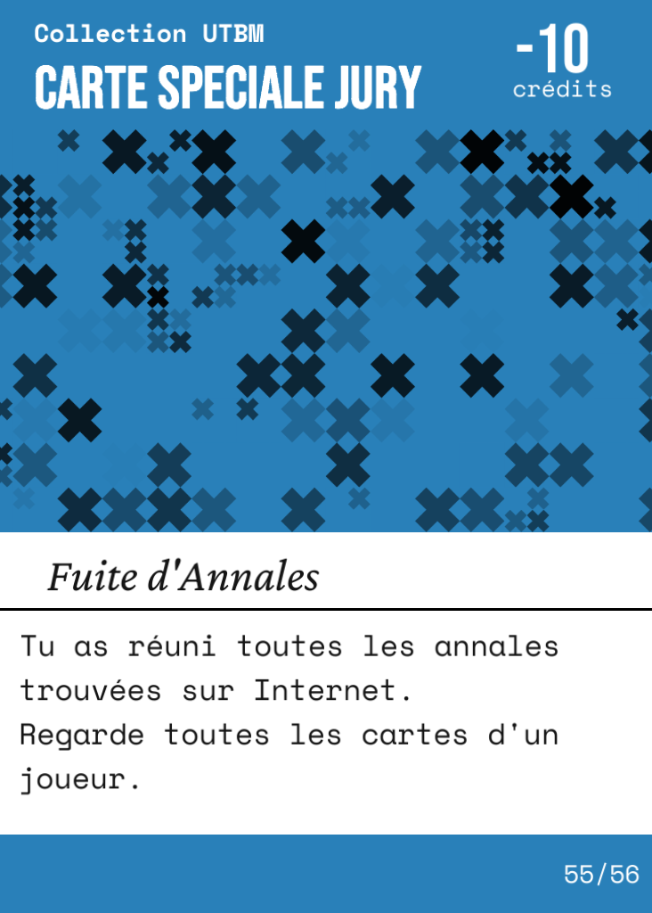

<h1 align="center">Mention F</h1>

  <em><strong>Le jeu de cartes où rater son semestre demande de la stratégie.</strong></em>
   
  <em>Il s'agit d'un jeu basé sur Lama mais comprenant des modifications afin d'adopter un style visuel en rapport avec l'UTBM.</em>

 

## Règles du jeu

### But du jeu
L'objectif est d'accumuler le plus de crédits ECTS en posant vos cartes et en gérant votre main. L'étudiant avec le plus de crédits à la fin de la partie valide son année.
Le joueur a le choix de jouer contre **1** ou **3** Robots.
Le jeu dure **8 manches** et les étudiants ont la possibilité de gagner jusqu'à **30 crédits** par manche. 

### Le Contenu
* **48** cartes U.E. (Unités d'Enseignement), numérotées de 1 à 6.
* **8** cartes Jury chacune ayant un bonus différent en jeu.

### Déroulement d'un tour
À votre tour, vous devez effectuer **une seule** des trois actions suivantes :
1. **Jouer une carte :** Poser une carte de même valeur ou d'une valeur supérieure de 1 par rapport au sommet de la pile. Sur un 6, vous pouvez poser un 6 ou une carte Jury. Sur une carte Jury, vous pouvez poser un Jury ou un 1.
2. **Piocher une carte :** Prendre la première carte de la pioche.
3. **Abandonner le semestre :** Quitter la manche en cours. Vous conservez vos cartes en main et ne jouez plus jusqu'à la fin de la manche.
**Chaque carte posée donne au joueur le nombre de crédits associé à sa valeur sauf les Jurys qui ne rapportent pas de points.**

### Fin de la manche
La manche se termine quand un joueur vide sa main ou quand tous les joueurs ont abandonné. Les cartes restantes en main valent des points de récompense ou de pénalité :
* Les cartes numérotées rapportent une valeur associée à leur famille (Exemple : 3 cartes de 2 crédits dans la main rapportent 2 crédits).
* Les cartes Jury en main valent 10 points de pénalité chacune.

---

## Images du jeu

<table align="center">
  <tr>
    <td align="center"></td>
    <td align="center"></td>
    <td align="center"></td>
    <td align="center"></td>
  </tr>
  <tr>
    <td align="center"><em>Jury 1</em></td>
    <td align="center"><em>Jury 2</em></td>
    <td align="center"><em>Jury 3</em></td>
    <td align="center"><em>Jury 4</em></td>
  </tr>
  <tr>
    <td align="center"></td>
    <td align="center"></td>
    <td align="center"></td>
    <td align="center"></td>
  </tr>
  <tr>
    <td align="center"><em>Jury 5</em></td>
    <td align="center"><em>Jury 6</em></td>
    <td align="center"><em>Jury 7</em></td>
    <td align="center"><em>Jury 8</em></td>
  </tr>
</table>
*[lien image du menu]*

*Légende : Aperçu d'une partie en cours.*

---

## Architecture et UML

Voici le diagramme de classes modélisant le moteur du jeu.

